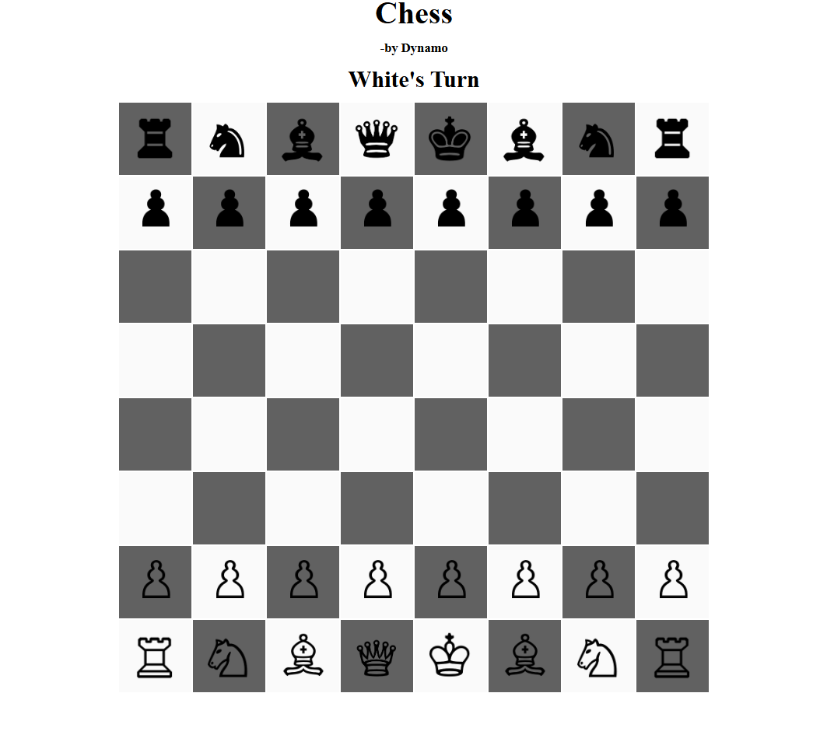

# ♟️ Web Chess Game

A fully functional web-based Chess game built using HTML, CSS, and JavaScript. Designed for two players, this game includes basic move validation, turn indication, and piece capturing mechanics.

---

## 🚀 Demo

To play the game, simply open `index.html` in a browser. No server or installation required.

---

## 📁 Project Structure

├── index.html # Main HTML layout for the chessboard and UI
├── Chess.css # Styling for the board and pieces
├── Chess.js # Game logic, interactivity, and rules
├── README.md # Project documentation


---

## 🎯 Features

- Fully playable chess game in the browser
- Turn-based logic with move restrictions
- Visual indicators for valid moves (highlighted squares)
- Win detection when the opposing king is captured
- Responsive design for different screen sizes

---

## 🛠️ Tech Stack

- **HTML5** – Markup and layout
- **CSS3** – Styling and responsiveness
- **JavaScript (Vanilla)** – Game logic and DOM manipulation

---

## 🧩 How to Use

1. Clone this repository:
    ```bash
    git clone https://github.com/mukesh5489/chess-game.git
    cd chess-game
    ```

2. Open the game:
    - Double-click `index.html`  
    - Or right-click and choose `Open with` → your browser

---

## 📸 Screenshots



---

## ✍️ Author

- **Dynamo**  
  GitHub: [@mukesh5489](https://github.com/mukesh5489)

---

## 📄 License

This project is open source under the [MIT License](LICENSE).
